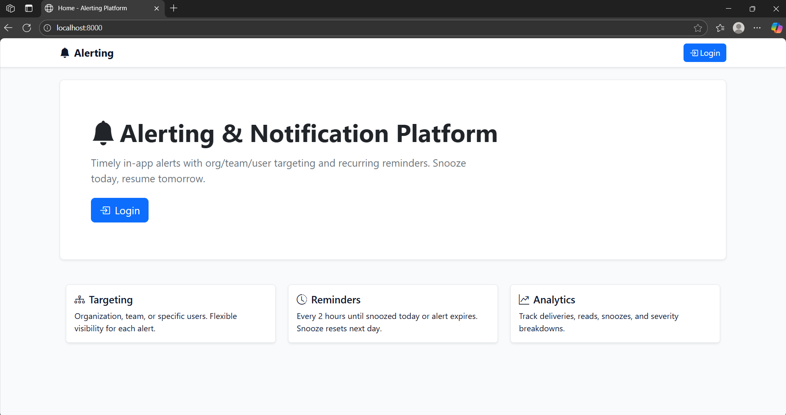
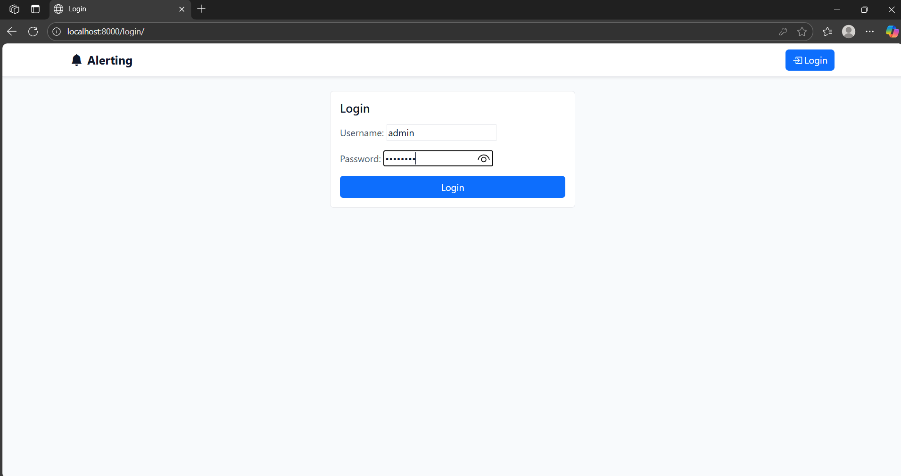
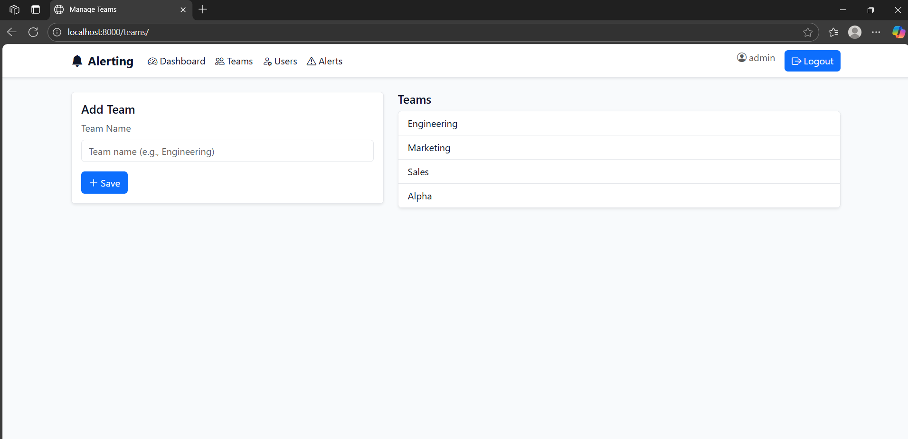
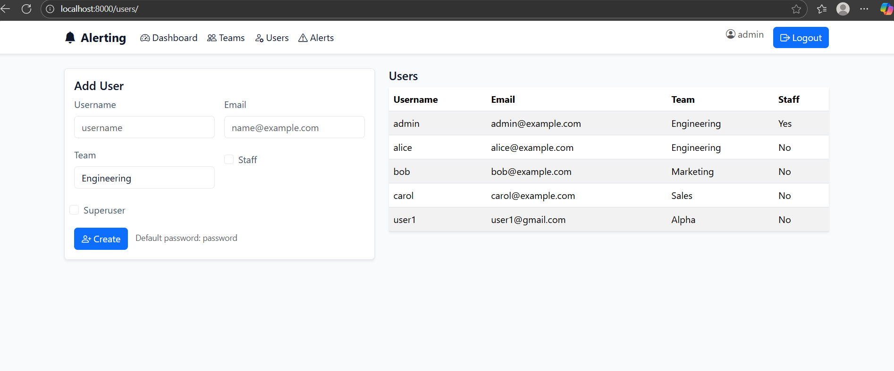
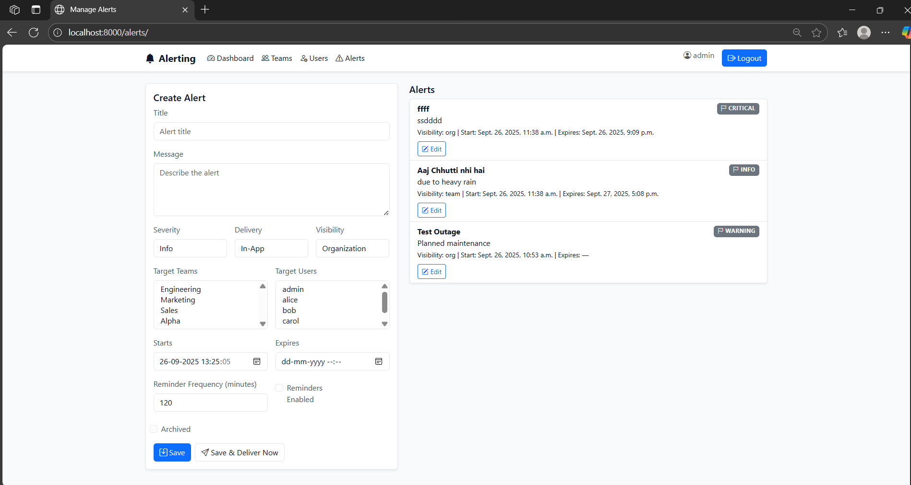
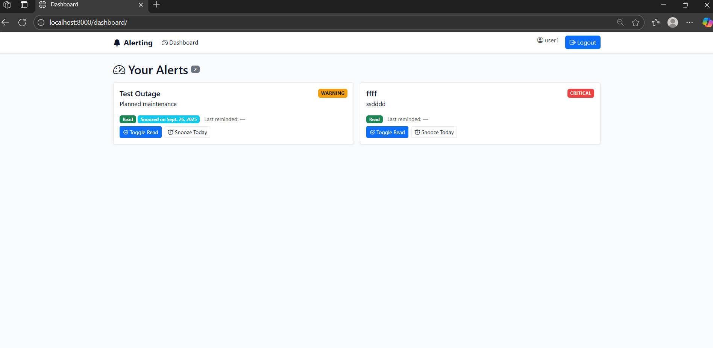
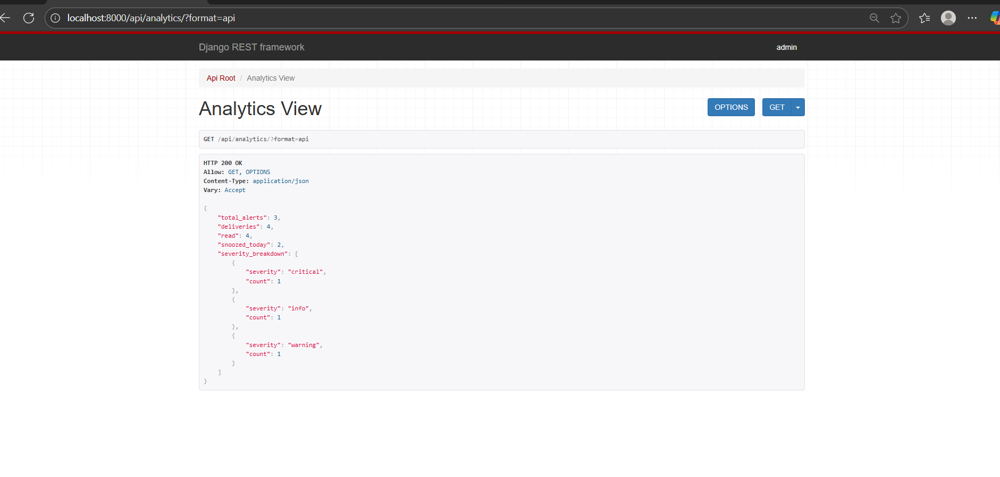
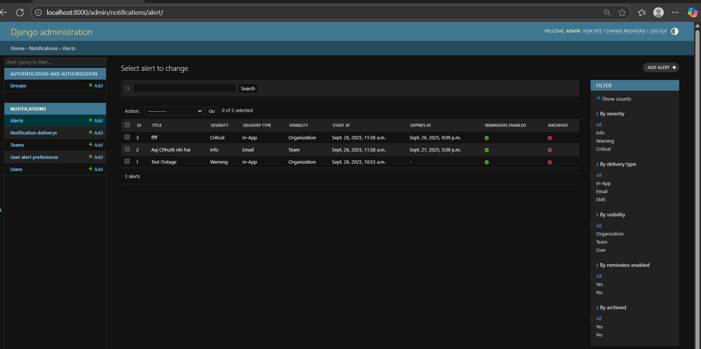

Alerting & Notification Platform (Django + DRF)

What this is
- In‑app alerts with org/team/user targeting, recurring reminders, snooze, and read/unread.
- Admin UI + REST APIs + simple Bootstrap web UI.

In simple words
- This app lets admins send messages (alerts) to everyone, to a team, or to specific users.
- Users see alerts in the app. Alerts remind every 2 hours until users read them or snooze for today.
- Admins can create, edit, and deliver alerts, and see basic analytics (how many sent, read, snoozed).

Main features
- Create and edit alerts with title, message, severity, start/expiry, and reminder frequency.
- Target by organization, team, or specific users.
- Users can mark alerts read/unread and snooze for today.
- Reminders auto-skip users who read or snoozed; snooze resets next day.
- Simple web dashboard and admin pages; REST APIs for integration.

Quick start (Windows PowerShell)
1) Setup
   - python -m venv .venv
   - .\.venv\Scripts\python -m pip install --upgrade pip
   - .\.venv\Scripts\python -m pip install -r requirements.txt
2) Init database and seed sample data
   - .\.venv\Scripts\python manage.py migrate
   - .\.venv\Scripts\python manage.py seed_data
3) Collect static (for UI styling)
   - .\.venv\Scripts\python manage.py collectstatic --noinput
4) Run
   - .\.venv\Scripts\python manage.py runserver

Logins
- Admin: username-admin / password : password
- Users: alice / bob / carol (password for each: password)

Web routes
- /           Home
- /login/     Login → redirects to /dashboard/
- /logout/    Logout → redirects to Home
- /dashboard/ My alerts (read/unread, snooze today)
- /teams/     Manage teams (staff)
- /users/     Manage users (staff)
- /alerts/    Create alerts (staff)
- /alerts/<id>/ Edit existing alert (staff)
- /admin/     Django admin

API routes
- Admin
  - GET /api/alerts/?severity=&archived=&reminders_enabled=&visibility=&status=active|expired
  - POST /api/alerts/
  - PATCH /api/alerts/{id}/
  - POST /api/alerts/{id}/deliver_now/
- User
  - GET /api/my-alerts/
  - POST /api/my-alerts/{pref_id}/read/ {"is_read": true|false}
  - POST /api/my-alerts/{pref_id}/snooze/ {"snooze_for_today": true}
- Analytics
  - GET /api/analytics/

How reminders work
- Default every 2 hours per alert (configurable).
- Skips users who have read the alert or snoozed it today.
- Snooze resets the next day.
- Manual trigger for demos/tests:
  - .\.venv\Scripts\python manage.py trigger_reminders

Verify the flow (manual test)
1) Login as admin → /alerts/ → create an alert (Org visibility) → Save & Deliver Now
2) Login as alice → /dashboard/ → see the alert → Toggle Read, Snooze Today
3) Run reminders → should not re‑notify read/snoozed users
4) Check /api/analytics/ → see totals and severity breakdown

Design notes
- Strategy pattern for channels in `notifications/services.py` (in‑app now; add email/SMS later).
- Separation of concerns: Alert management, Delivery service, User preferences, Analytics.

Screenshots

